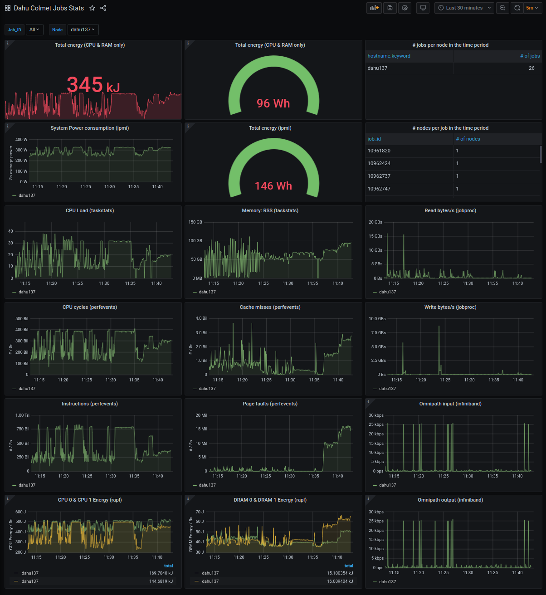
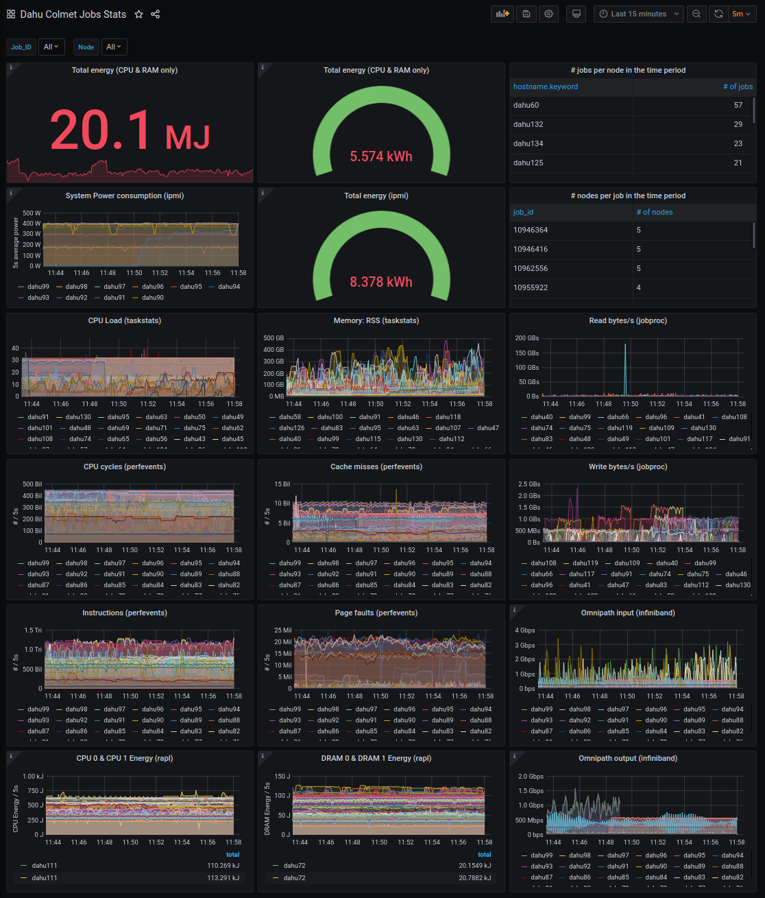

# Colmet - Collecting metrics about jobs running in a distributed environnement

## Introduction:

Colmet is a monitoring tool to collect metrics about jobs running in a
distributed environnement, especially for gathering metrics on clusters and
grids. It provides currently several backends :
- Input backends:
  - taskstats: fetch task metrics from the linux kernel
  - rapl: intel processors realtime consumption metrics
  - perfhw: perf_event counters
  - jobproc: get infos from /proc
  - ipmi: get power metrics from ipmi
  - temperature: get temperatures from /sys/class/thermal
- Output backends:
  - elasticsearch: store the metrics on elasticsearch indexes
  - hdf5: store the metrics on the filesystem
  - stdout: display the metrics on the terminal

It uses zeromq to transport the metrics across the network.

It is currently bound to the [OAR](http://oar.imag.fr) RJMS.

A Grafana sample dashboard is provided for the elasticsearch backend.





## Installation:

### Requirements

* a Linux kernel that supports
- Taskstats

* Python Version 2.7 or newer
- python-zmq 2.2.0 or newer
- python-tables 3.3.0 or newer
- python-pyinotify 0.9.3-2 or newer

### Installation

You can install, upgrade, uninstall colmet with these commands::

$ pip install [--user] colmet
$ pip install [--user] --upgrade colmet
$ pip uninstall colmet

Or from git (last development version)::

$ pip install [--user] git+https://github.com/oar-team/colmet.git

Or if you already pulled the sources::

$ pip install [--user] path/to/sources

### Usage:

for the nodes :

sudo colmet-node -vvv --zeromq-uri tcp://127.0.0.1:5556

for the collector :

colmet-collector -vvv --zeromq-bind-uri tcp://127.0.0.1:5556 --hdf5-filepath /data/colmet.hdf5 --hdf5-complevel 9

You will see the number of counters retrieved in the debug log.


For more information, please refer to the help of theses scripts (--help)

### Notes about backends

#### RAPL - Running Average Power Limit (Intel)

RAPL is a feature on recent Intel processors that makes possible to know the power consumption of cpu in realtime.

Usage : start colmet-node with option `--enable-RAPL`

A file named RAPL_mapping.[timestamp].csv is created in the working directory. It established the correspondence between `counter_1`, `counter_2`, etc from hdf5 files and the actual name of the metric as well as the package and zone (core / uncore / dram) of the processor the metric refers to.

If a given counter is not supported by harware the metric name will be "`counter_not_supported_by_hardware`" and `0` values will appear in hdf5 table; `-1` values in hdf5 table means there is no counter mapped to the column.

#### Perfhw

This provides metrics collected using  interface [perf_event_open](http://man7.org/linux/man-pages/man2/perf_event_open.2.html).

Usage : start colmet-node with option `--enable-perfhw`

Optionnaly choose the metrics you want (max 5 metrics) using options `--perfhw-list` followed by space-separated list of the metrics/

Example : `--enable-perfhw --perfhw-list instructions cpu_cycles cache_misses`

A file named perfhw_mapping.[timestamp].csv is created in the working directory. It establishes the correspondence between `counter_1`, `counter_2`, etc from hdf5 files and the actual name of the metric.

Available metrics (refers to perf_event_open documentation for signification) :

```
cpu_cycles 
instructions 
cache_references 
cache_misses 
branch_instructions
branch_misses
bus_cycles 
ref_cpu_cycles 
cache_l1d 
cache_ll
cache_dtlb 
cache_itlb 
cache_bpu 
cache_node 
cache_op_read 
cache_op_prefetch 
cache_result_access 
cpu_clock 
task_clock 
page_faults 
context_switches 
cpu_migrations
page_faults_min
page_faults_maj
alignment_faults 
emulation_faults
dummy
bpf_output
```

#### Temperature

This backend gets temperatures from /sys/class/thermal/thermal_zone*/temp

Usage : start colmet-node with option `--enable-temperature`

A file named temperature_mapping.[timestamp].csv is created in the working directory. It establishes the correspondence between `counter_1`, `counter_2`, etc from hdf5 files and the actual name of the metric.

